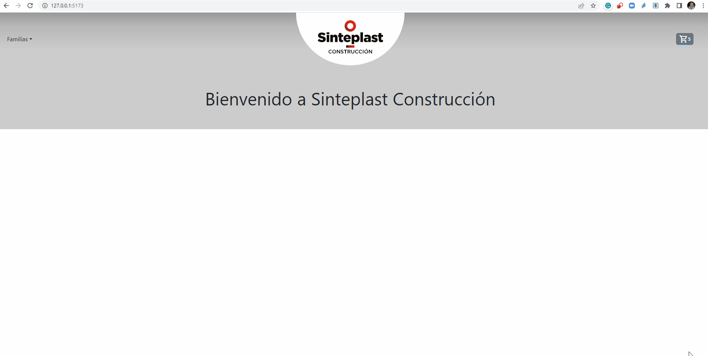

# Sinteplast Construccion Online

## Entrega final Curso React JS Coderhouse

### App de e-commerce de Sinteplast Construccion para vender sus productos online

La aplicación es la extensión del sitio [sinteplastconstruccion.com.ar](https://www.sinteplastconstruccion.com.ar).

En [sinteplastconstruccion.com.ar](https://www.sinteplastconstruccion.com.ar) se presenta la empresa, los productos, documentación para su descarga y obras relacionadas. También se ofrecen capacitaciones presenciales.
Este sitio lo desarollé usando javascript, Bootstrap, PHP y MySql.

Sinteplast Construccion Online es la app de e-commerce de [sinteplastconstruccion.com.ar](https://www.sinteplastconstruccion.com.ar), donde el usuario podra listar todos los productos, añadirlos a un carro de compra y generar el pedido.

---

### Librerías utilizadas

#### Vite

[vitejs.dev](https://es.vitejs.dev/)

Herramienta de compilación que tiene como objetivo proporcionar una experiencia de desarrollo más rápida y ágil para proyectos web modernos

#### React Router

[reactrouter.com](https://reactrouter.com/)

Facilita el proceso de definir las rutas de navegación dentro de nuestra aplicación.

#### Firebase

[firebase.google.com](https://firebase.google.com/)

Plataforma de desarrollo de apps que te ayuda a compilar y desarrollar las apps. Para este proyecto utilizamos Cloud Firestore. Es una base de datos de documentos NoSQL que permite almacenar, sincronizar y consultar fácilmente datos en tus apps web y para dispositivos móviles a escala global.

#### html-react-parser

[npmjs.com/package/html-react-parser](https://www.npmjs.com/package/html-react-parser)

Esta herramienta convierte strings HTML a uno o mas elementos de React. Se utilizó para incorporar las descripciones de la base de datos original de [sinteplastconstruccion.com.ar](https://www.sinteplastconstruccion.com.ar) que contenian strings HTML.

#### React Bootstrap

[react-bootstrap.github.io](https://react-bootstrap.github.io/)

Reemplaza Boostrap Javascript. Cada componente de React Bootstrap fue construido desde cero como un componente React, sin las innecesarias dependencias como JQuery.

---

### Componentes

#### App

Contiene los componentes centrales de la aplicación

1. [Navbar](#navbar)
1. [ItemListContainer](#itemlistcontainer)
1. [ItemDetailContainer](#itemdetailcontainer)
1. [Cart](#cart)
1. [PedidoContainer](#pedidocontainer)
1. [EstadoCarroContexto](#estadocarrocontexto)
1. [Banner](#banner)
1. [Footer](#footer)

<a name="navbar"></a>

#### Navbar

Barra de navegación

Contiene:

1. Lista de categorías seleccionables
1. Logo de la empresa con enlace al inicio del sitio
1. [CartWidget](#cartwidget)

<a name="cartwidget"></a>

#### CartWidget

Muestra la unidades totales de [EstadoCarroContexto](#estadorcarrocontexto) y enlaza a `/cart`

<a name="itemlistcontainer"></a>

#### ItemListContainer

Descarga la información de los productos de la base de datos y se la pasa a [ItemList](#itemlist)

<a name="itemlist"></a>

#### ItemList

Cicla los productos con el componente [Item](#item)

<a name="item"></a>

#### Item

Genera un _Card_ (tarjeta) con los siguientes elementos del producto:

-   Imagen.
-   Nombre.
-   Descripción breve
-   Precio.
-   Stock.
-   Enlace al producto.

<a name="itemdetailcontainer"></a>

#### ItemDetailContainer

Descarga la información del productos de la base de datos y se la pasa a [ItemDetail](#itemdetail)

<a name="itemdetail"></a>

#### ItemDetail

Genera una vista con los siguientes elementos del producto:

-   Imagen.
-   Nombre.
-   Descripción breve.
-   Precio.
-   Stock.
-   Unidades
-   Botones para sumar, restar, resetear las unidades y para enviar al carro y quitar el producto del carro.
-   Lista de características del producto.

Al modificarse el carro pasa los datos al componente [EstadoCarroContexto](#estadorcarrocontexto)

<a name="cart"></a>

### Cart

Si el carro esta vacio devuelve un mensaje _"Tu pedido esta vacío"_.

Si hay productos en el carro cicla el componente [CartItem](#cartitem) con los productos en el carro de [EstadoCarroContexto](#estadorcarrocontexto)

Presenta el total del pedido y dos botones que permiten manejar el estado del pedido en [EstadoCarroContexto](#estadorcarrocontexto)

Los posibles estados del pedido son
| id | estado |
| ----------- | ----------- |
| 0 | Pedido abierto |
| 1 | Pedido cerrado |
| 2 | En preparación |
| 3 | En camino |
| 4 | Entregado |
| 5 | Entrega fallida |

-   El boton **FINALIZAR PEDIDO** pasa a estado 1
-   El boton **MODIFICAR PEDIDO** vuelve a estado 0

Adicionalmente trae el componente [CartForm](#cartform)

<a name="cartitem"></a>

#### CartItem

Genera un _Row_ (fila) con los siguientes elementos del producto:

-   Imagen.
-   Nombre.
-   Unidades
-   Stock.
-   Precio unitario.
-   Precio total.
-   Botones para sumar, restar, resetear las unidades y para enviar al carro y quitar el producto del carro.

<a name="cartform"></a>

#### CartForm

Contiene el formulario con los datos para enviar a la colección **pedidos** de firestore.
los datos del pedido se almacenan con la siguiente estructura

```
{
    "datosPedido": {
        "apellido": "Socorro",
        "nombre": "Juan",
        "localidad": "Villa del Parque",
        "calle-num": "2406",
        "cca": "11",
        "cp": "1417",
        "provincia": "Villa del Parque",
        "calle": "Baigorria",
        "cnum": "21743449",
        "email": "jsocorro@sismatica.net"
      },
      "fecha": {
        "seconds": 1680215289,
        "nanoseconds": 532000000
      },
      "pedido": [
        {
          "precio": 9400,
          "id": 44,
          "nombre": "Manto Geotextil",
          "stock": 67,
          "descripcion1": "<div>Refuerzo de impermeabilizaciones de techos<br></div>",
          "archivo": "geo-textil-01.png",
          "unidades": 1
        }
      ],
      "estado": 2
    },
```

Las validaciones se realizan utilizando las funciones de react-bootsrap.

El formulario se muestra unicamente cuando el **estado del pedido es 1**

Cuando el pedido es enviado correctamente navega a `/pedido/:id` donde se carga el componente [PedidoContainer](#pedidocontainer)

<a name="pedidocontainer"></a>

#### PedidoContainer

Descarga la información del pedido `id` de la base de datos y se la pasa a [Pedido](#pedido)

<a name="pedido"></a>

#### Pedido

Rellena los datos del pedido con la informacion dentro de `datosPedido`.

Cicla los productos en `pedido` con el componente [Item](#item).

Suma y muestra el total con la información de `pedido`.

<a name="pedidoitem"></a>

#### PedidoItem

Genera un `Row` con los siguientes elementos del producto:

-   Imagen.
-   Nombre.
-   Precio unitario.
-   Precio total.
-   Unidades.

<a name="estadocarrocontexto"></a>

#### EstadoCarroContexto

Provee el contexto para el carro de compras.

Se almacena y comparte lo siguiente:
1. `carro` *(array)* contiene los productos.
1. `unidadesTotales` *(number)* suma de las unidades de todos los productos.
1. `total` *(number)* suma del precio de los productos en el carro por la unidades.
1. `estadoPedido` *(number)* estado del pedido.
1. `agregarProducto` *(funcion)* agrega un producto al `carro`.
1. `quitarProducto` *(funcion)* quita un producto del `carro`.
1. `borrarCarro` *(funcion)* convierte `carro` a un array vacío.
1. `asignarEstado`, *(funcion)* modifica el valor de `estado`.

<a name="banner"></a>

#### Banner

Componente para desarrollar mas adelante que permita la inclución de banners dinámicos.

<a name="footer"></a>

#### Footer

Componente para desarrollar mas adelante que permita la inclución de enlaces a redes sociales dinámicos.


### Funcionamiento

#### Listado de productos y filtrado por categorías


#### 

[https://www.screentogif.com/]: #


